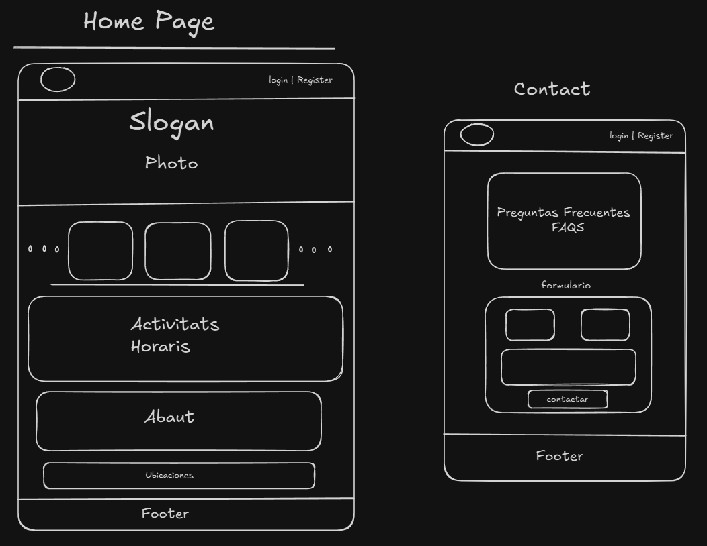
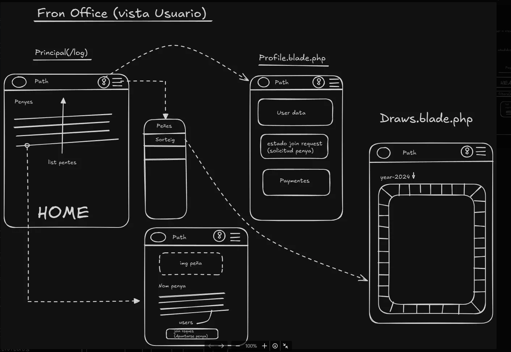
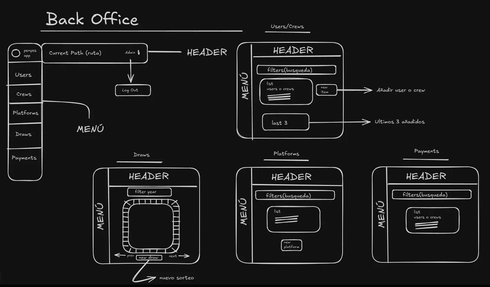

# 🎉 Penyes App 🎉

Bienvenido a **Penyes App**, un proyecto para gestionar las festividades de un pueblo. Aquí las "peñas" (grupos de personas que organizan eventos) pueden interactuar, y el administrador puede gestionar usuarios, peñas, sorteos y pagos de membresía. Este README te guiará a través de las secciones principales del proyecto: configuración inicial, Home Page, Front Office y Back Office.

---

## 🚀 Configuración Inicial

### Tecnologías y Configuración

Este proyecto está basado en **Laravel 11** y utiliza **Docker** para su entorno de desarrollo, junto con una arquitectura de contenedores que incluye Nginx, MariaDB, y Mailhog para gestionar los correos de verificación en un entorno seguro y aislado.

1. **Clona el repositorio**:
    
    ```bash
    git clone https://github.com/Andreu-08/Penyes_App.git
    cd penyes-app
    ```
    
2. **Configura Docker**:
    - Actualiza tu usuario en el archivo `docker.compose.override`.
3. **Inicia Docker**:
    
    ```bash
    docker-compose up -d --build
    ```
    
4. **Ejecuta migraciones y seeders**:
    - Accede al contenedor:

        ```bash
        docker exec -it penyes-app /bin/bash
        ```
        
    - Ejecuta los comandos:
        
        ```bash
        php artisan migrate --seed
        ```
        
    Esto configurará las tablas necesarias, creará roles (`Admin` y `User`), y generará datos iniciales, como:
    
    - **5 peñas ficticias** para pruebas.
    - **Usuarios preconfigurados**:
        - **Admin**:
            - Email: `admin@admin.com`
            - Contraseña: `administrador`
        - **User**:
            - Email: `user@user.com`
            - Contraseña: `usuario`

5. **Compila los assets de frontend**:
    
    ```bash
    npm install
    npm run dev
    ```

    Esto compilará los archivos CSS y JavaScript necesarios para el frontend del proyecto.

5. **Accede a la aplicación** en [http://localhost:8080](http://localhost:8080/).

---

## 🏠 Home Page

La Home Page es la cara visible de Penyes App para los visitantes que aún no están registrados. Aquí pueden obtener una visión general de las festividades y peñas, además de acceder a un carrusel de actividades.

### Características Principales

- **Slogan y Foto Principal**: Una imagen que representa el espíritu de las peñas y un eslogan atractivo.
- **Carrusel de Actividades**: Aquí se muestran imágenes de eventos y actividades pasadas.
- **Secciones de Actividades y Horarios**: Los visitantes pueden ver un horario general de las actividades.
- **Contacto y FAQ**: Incluye un formulario para enviar correos directamente desde la aplicación.
- **Footer con Ubicaciones**: Información adicional sobre dónde se celebran las actividades.



---

## 🧭 Front Office - Vista de Usuario

Esta es la vista para usuarios registrados. Después de hacer login, los usuarios pueden explorar las peñas, solicitar unirse a una, y gestionar su perfil.

### Funcionalidades del Front Office

- **Explorar Peñas**: Visualizar una lista de peñas disponibles y detalles específicos presionando "Ver".
- **Solicitar Membresía**: Permite a los usuarios solicitar unirse a una peña específica, con confirmación pendiente del administrador.
- **Perfil de Usuario**: Gestionar y modificar datos personales, ver estado de membresías y pagos.



---

## 🛠️ Back Office - Panel de Administración

La vista de Back Office está diseñada exclusivamente para el administrador. Este panel permite gestionar usuarios, peñas, sorteos y pagos de membresía. Es la columna vertebral de Penyes App.

### Funcionalidades del Back Office

- **CRUD de Usuarios y Peñas**:
    - Ver, crear, editar y eliminar usuarios y peñas.
    - Confirmar solicitudes de membresía desde el perfil del usuario.
    - Enviar correos desde la vista individual de usuarios.
- **Sorteos y Pagos**:
    - Aunque las rutas están configuradas, estas funcionalidades están pendientes de implementación.



---

## 🌍 Tecnologías y Dependencias Principales

- **Laravel 11**: El framework backend.
- **Docker**: Para el entorno de contenedores.
- **MariaDB**: Base de datos para almacenar usuarios, peñas y sorteos.
- **Mailhog**: Herramienta de testing para el envío de correos de verificación.
- **Bulma CSS (CDN)**: Estiliza la interfaz de usuario de una forma sencilla y elegante.

---


